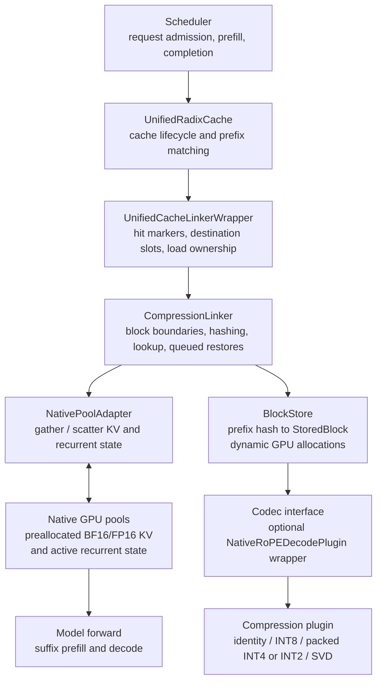

# SGLang prefix compression linker architecture

This document describes the experimental implementation in this checkout. The
compression linker connects SGLang's request/cache lifecycle to a GPU-resident
compressed block store. It uses the external-cache interface, but its payloads
stay on the local GPU; there is no CPU or remote storage tier in this backend.

The diagrams show the explicit `compressed` / `frozen` experiment path, where
native cross-request prefix reuse is disabled. The engine still uses ordinary
native KV for attention and retains each active request's own KV across chunks
and decoding steps.

## Component architecture



Arrows above describe calls and access relationships, rather than a single
chronological data flow. The source and target paths below show execution order.

| Component | Responsibility |
| --- | --- |
| `UnifiedRadixCache` | Receives normal cache hooks. In compressed-only mode, bypasses native/session prefix matching. |
| `UnifiedCacheLinkerWrapper` | Converts matches into scheduler-visible hits, allocates destination slots, and manages pending/private loads. |
| `CompressionLinker` | Identifies completed blocks, looks up available blocks, and coordinates storage and restoration. |
| `NativePoolAdapter` | Gathers physical KV slots into plugin tensors and scatters reconstructed tensors back; also copies hybrid state. |
| `BlockStore` | Owns payloads, original shapes/dtypes, optional checkpoints, and byte accounting. |
| Compression plugin | Implements numerical encoding, scratch preparation, and reconstruction. |
| Optional RoPE adapter/wrapper | De-rotates native keys before compression and reapplies the model's RoPE after reconstruction. |

## Compression unit and stored entry

One block contains `block_pages * page_size` consecutive prompt tokens. With
`block_pages=16` and `page_size=256`, a block contains 4,096 tokens. Its lookup key
is the chained prefix hash at its final page. Matching requires the same preceding
token prefix, and identical prefixes share stored blocks.

```text
Prompt:  [ block 0 ][ block 1 ][ block 2 ][ incomplete tail ]
Store:   [payload 0][payload 1][payload 2][     nothing     ]

store.blocks[prefix_hash]
    StoredBlock
    +-- payload
    |   +-- tensors: dict[str, GPU Tensor]
    |   +-- metadata: JSON-compatible dictionary
    +-- specification: original K/V shapes and dtypes
    +-- state: raw temporal/conv checkpoint, or None
    +-- record: byte counts and compression ratio
    +-- metadata_json: serialized identity, context, and specifications
```

The codec receives separate K/V tensors shaped
`[block_pages, attention_layers, page_size, kv_heads, head_dim]`. For hybrid
models, these are the full-attention layers; recurrent state is stored separately.

Each block is one plugin call and one independent payload. INT8 and packed
INT4/INT2 quantize rows along the head dimension. SVD groups layers within the
block, factorizing matrices shaped
`[block_tokens, group_layers * kv_heads * head_dim]`. Numerical layer grouping
does not change the block's storage or lookup granularity.

Lookup restores consecutive whole blocks and stops at the first miss. There is
no partial-block restoration. SGLang normally leaves at least one input token
for forward computation, so a fully available prompt of length `N` generally
has a compressed hit bounded by `floor((N - 1) / block_tokens) * block_tokens`.

## Source path: compute, compress, store

```text
Model computes a prefill chunk into native GPU KV
    |
    v
cache_unfinished_req() / cache_finished_req()
    |
    v
CompressionLinker.on_request_progress()
    |
    v
Find newly completed prompt blocks; skip existing keys
    |
    v
NativePoolAdapter.gather_kv(request slots)
    |
    v
Optional: de-rotate keys into pre-RoPE space
    |
    v
BlockStore.insert()
    +-- plugin.compress(K, V)
    +-- clone payload tensors into store-owned GPU storage
    +-- copy raw recurrent checkpoint, if hybrid
    +-- record original/payload/metadata/state bytes
```

Compression runs synchronously on the scheduler path. It is triggered by request
progress, including prefill completion and request completion before slots are
freed. It is not triggered by memory pressure, radix-node splitting, eviction, or
tree write-through. Generated continuation tokens are excluded from this store.

For hybrid models, the live recurrent checkpoint must correspond exactly to the
block endpoint before decode advances it. Block size must align with the prefill
chunk size, and actual observed progress must reach that endpoint. Missing state
causes a `block_skipped_no_state` event. To make that progress reach every block
end even when several requests share one chunk budget, the linker exposes
`prefill_boundary_tokens` and `UnifiedRadixCache.prefill_boundary_tokens()`
hands it to the scheduler's `PrefillAdder`, which never lets a prefill chunk
cross an absolute multiple of the block size (a chunk may end early; the next
one is capped at the same boundary). The linker-side check remains the safety net.

Compression copies a representation into the store; it does not free the active
source's KV. On normal request completion, its native slots become reusable,
while the compressed payload survives until store reset.

## Target path: match, reconstruct, execute

```mermaid
sequenceDiagram
    participant S as Scheduler / Cache
    participant W as Linker Wrapper
    participant C as CompressionLinker
    participant B as BlockStore / Plugin
    participant N as Native GPU Pools

    S->>W: match_prefix(request)
    W->>C: lookup(chained page hashes)
    C->>B: Check consecutive whole blocks
    B-->>C: Available blocks
    C-->>W: Restorable prefix lengths
    W-->>S: Report hit length

    S->>W: init_load_back(request)
    W->>N: Allocate request-private slots
    W->>C: load(request ID, destination slots)
    Note over C: Queue only; no reconstruction yet

    S->>C: start_layer_wise_loading() via cache and wrapper
    C->>B: reconstruct(block keys)
    B->>B: Allocate outputs and scratch
    B->>B: Decompress; optionally reapply RoPE
    B-->>C: Native-dtype K/V tensors
    C->>N: Scatter KV; restore final recurrent checkpoint
    C->>C: Synchronize GPU work; publish completion
    C-->>S: Load batch complete
    S->>N: Forward reads restored prefix
```

Despite the name `start_layer_wise_loading`, the compression backend restores
queued requests synchronously before forward execution. It does not stream
decompression layer by layer alongside attention.

Every target gets private destination slots, including duplicate requests in a
batch. Restored KV is not inserted into the native radix tree in compressed-only
mode. A hybrid target restores the checkpoint from the last matched block.

The wrapper tracks hit markers, pending loads, and private destinations. This
keeps ownership explicit when admission is deferred or a request is cancelled.
Normal request completion returns active slots to their allocators.

## Memory ownership and measurements

| Category | Lifetime and allocation |
| --- | --- |
| Native GPU KV backing | Sized during engine initialization and retained; allocating/freeing request slots does not shrink the backing tensors. |
| Compressed payloads | Dynamically allocated per stored block; store-owned copies survive request completion until reset. |
| Raw hybrid checkpoints | Dynamically copied per stored block. |
| Reconstruction outputs | Full native-dtype outputs allocated for all requested blocks on each reconstruction, then scattered into native destinations. |
| Codec scratch | Allocated before decompression timing; SVD reuses compatible scratch across layer groups within a block. |
| PyTorch allocator reserve | May retain freed allocation segments for reuse. |

The compressed store has no fixed-capacity preallocation, byte budget, or
eviction policy. It consumes GPU memory outside the native slot allocator's
capacity accounting.

A hit temporarily involves compressed payloads, reconstruction outputs/scratch,
and native destination slots. Thus payload compression ratio does not directly
equal process GPU-memory reduction.

Current per-block accounting is:

```text
original_bytes    = original K/V tensor bytes
payload_bytes     = owned encoded tensor storage bytes, including scales/factors
metadata_bytes    = serialized metadata size
state_bytes       = raw recurrent checkpoint bytes
compressed_bytes  = payload_bytes + metadata_bytes
compression_ratio = original_bytes / compressed_bytes
```

For a pure payload ratio, use `sum(original_bytes) / sum(payload_bytes)` over the
live, unique blocks. To include unchanged recurrent state, compare
`sum(original_bytes + state_bytes)` against
`sum(payload_bytes + state_bytes)`. Report serialized host metadata separately or
add it to the latter denominator for an accounted representation ratio.

Decompression timing excludes output/scratch allocation, scatter, and recurrent
state restoration. It includes RoPE reapplication when enabled. Measure full
restoration latency and allocated/reserved GPU memory separately inside the
scheduler worker.

## Mode controls

| Mode | Compression writes | Cross-request reuse | Clears existing cache |
| --- | --- | --- | --- |
| `no_reuse` | Off | None | Yes |
| `native` | Off | Native radix prefixes | Yes |
| `compressed` | On | Compressed blocks restored into private slots | Yes |
| `frozen` | Off; existing blocks retained | Compressed blocks restored into private slots | No |

Controls require an idle engine. `frozen` requires an existing compressed mode.
Backend initialization alone leaves writes enabled and native reuse available;
explicitly enter `compressed` mode for the private-restoration path above.

```python
engine.collective_rpc("prefix_compression_control", action="compressed")
# Run source requests to populate blocks.
engine.collective_rpc("prefix_compression_control", action="frozen")
# Run target requests to measure independent reconstruction and quality.
```

Audit is optional instrumentation for source encoding, scatter correctness,
attention reads, and prefix recomputation. It requires CUDA graphs disabled and
adds memory/work, so keep it separate from performance measurements.

## Code map

- [Configuration and usage](README.md)
- [CompressionLinker and NativePoolAdapter](linker.py)
- [BlockStore and StoredBlock](store.py)
- [Payload interface and built-in codecs](plugin.py)
- [RoPE conversion](pre_rope.py)
- [Provenance audit](audit.py)
- [UnifiedCacheLinkerWrapper](../unified_cache/unified_cache_linker.py)
- [UnifiedRadixCache hooks](../unified_radix_cache.py)
- [Scheduler mode controls](../../managers/scheduler.py)
- [Native GPU pools](../memory_pool.py)

The adapter currently supports one GPU with ordinary BF16/FP16 full-attention KV,
including the full-attention pool of supported hybrid recurrent models. TP/PP,
attention context parallelism, LoRA, speculative decoding, quantized active KV,
ReplaySSM ring state, and int8 recurrent checkpoints are outside its current scope.
